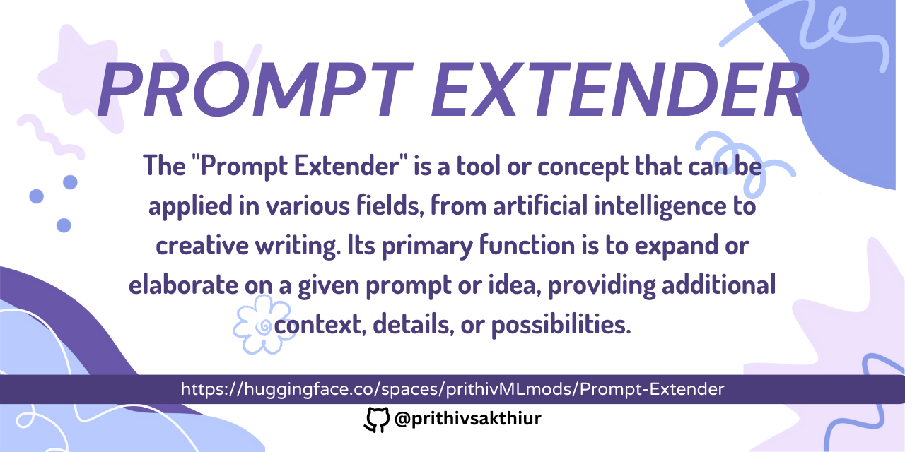
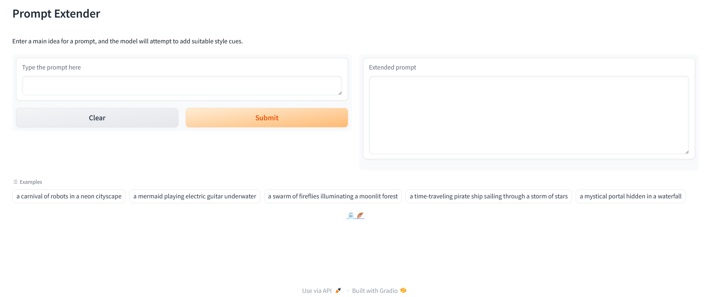
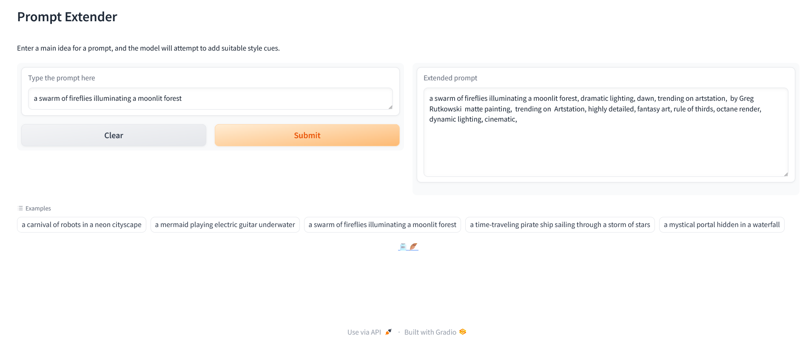

✏️Check out the configuration reference at https://huggingface.co/docs/hub/spaces-config-reference

🚀Huggingface space : https://huggingface.co/spaces/prithivMLmods/Prompt-Extender

🚀To Clone Just Install Git Past the Command : git clone https://huggingface.co/spaces/prithivMLmods/Prompt-Extender

## 🫙Non extended prompt as Input. 

## ⚡Extended Prompt as Outcome.

.

.

.
